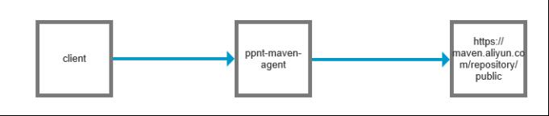

# ppnt-maven-agent
## 1.什么是ppnt-maven-agent
ppnt-maven-agent是一个maven代理服务  
ppnt-maven-agent接收client发送的下载请求从远程下载jar包,将jar包保存到本地并返回给ppnt-maven-agent  
  
假设发送的请求地址是  
http://127.0.0.1:10016/maven/com/jfinal/jfinal/4.9.12/jfinal-4.9.12.jar  
则真实的请求地址是  
https://maven.aliyun.com/repository/public/com/jfinal/jfinal/4.9.12/jfinal-4.9.12.jar  

### 安装
### 2.1.下载文件
地址  
https://gitee.com/ppnt/ppnt-maven-agent/releases/
### 2.1.windows安装
1)解压文件  
2)进入解压目录  
3)执行启动命令  
start.bat  

### 2.3.linux安装
解压文件
```
tar -xf ppnt-maven-agent-1.0-release.tar.gz
```
进入解压目录
```
cd ppnt-maven-agent-1.0
```
执行启动命令
```
springboot.sh start
```
### 2.4.测试
访问测试
http://127.0.0.1:10016/maven/com/jfinal/jfinal/4.9.12/jfinal-4.9.12.jar

## 3.配置
### 3.1.配置客户端
修改maven的setting.xml 添加下面的配置
```
  <mirrors>
    <mirror>
      <id>ppnt-maven-agent</id>
      <name>ppnt-maven-agent</name>
      <mirrorOf>*</mirrorOf>
      <url>http://192.168.104.101:10016/maven</url>
    </mirror>
  </mirrors>
```
### 3.2.服务端配置
修改配置文件  
默认配置文件在config/application.properties下,默认内容如下  
```
server.port=10016
server.context-path=/maven
spring.resources.static-locations=classpath:/ppnt-maven-agent/

logging.path=logs
logging.pattern.console=%d{yyyy-MM-dd HH:mm:ss.SSS} %-5level%logger{0}.%M:%L - %msg%n
logging.pattern.file=%d{yyyy-MM-dd HH:mm:ss.SSS} %-5level%logger{0}.%M:%L - %msg%n

spring.main.banner-mode = off
spring.devtools.restart.trigger-file:trigger.txt

#maven remote url
maven.center.url=https://maven.aliyun.com/repository/public
#maven local url
maven.local.path=D:\\dev_mavenRepository
```
整合nginx
```
  location /maven{
    proxy_pass http://127.0.0.1:10016;
  }
```
